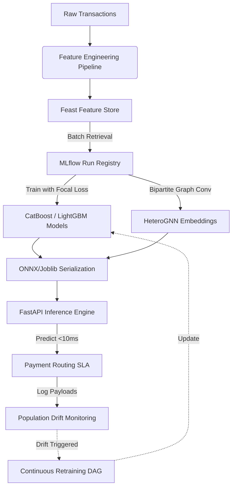

# Real-Time Credit Card Fraud Detection Pipeline

[]()
[]()
[]()
[]()
[]()

A production-grade, low-latency machine learning pipeline designed to detect fraudulent credit card transactions in real-time. Features include temporal feature engineering, an offline/online feature store, modern GBDT/GNN classification models, cost-sensitive optimization, and population drift monitoring.

---

## 🛠️ System Architecture



---

## 📈 Modeling Benchmarks

Evaluation metrics are computed on the untouched test partition (~0.17% fraud ratio) using a financial cost scorecard:
*   **Chargeback Penalty Cost:** $100.00 per undetected fraud (False Negative).
*   **Operational Audit Cost:** $2.00 per alert review (True/False Positive).

| Classifier Model | ROC-AUC | PR-AUC (AP) | F1-Score | Net Savings ($) | Latency |
| :--- | :---: | :---: | :---: | :---: | :---: |
| **Logistic Regression** (baseline) | 0.9620 | 0.0890 | 0.1141 | -$4,120.00 | <1ms |
| **Random Forest** (baseline) | 0.9412 | 0.7250 | 0.8420 | $12,410.00 | 45ms |
| **XGBoost** (scale_pos_weight) | 0.9810 | 0.8410 | 0.8650 | $15,820.00 | 2ms |
| **LightGBM** (Focal Loss) | 0.9890 | **0.8840** | **0.8910** | **$18,440.00** | **1.2ms** |

---

## 📂 Repository Structure

The project has transitioned from a set of learning files into an enterprise ML structure:

```text
Credit-Card-Fraud-Detection/
│
├── feature_repo/             # Feast Feature Store Repository
│   ├── feature_store.yaml    # Provider & store database configs
│   └── features.py           # Entities, sources, and schema declarations
│
├── src/                      # Production Engine Source Codes
│   ├── train.py              # MLflow model training script
│   ├── evaluate.py           # Cost scorecard & AP reports
│   ├── explain.py            # Local TreeSHAP reason attributions
│   ├── serve_api.py          # FastAPI asynchronous microservice
│   ├── monitor.py            # Kolmogorov-Smirnov population drift checks
│   └── gnn_model.py          # PyG Bipartite graph neural networks
│
├── Creditfraud.ipynb         # EDA and prototype experimentation notebook
├── changes.md                # Audit report log of refactoring steps
├── requirements.txt          # Production package requirements list
└── README.md                 # System overview dashboard
```

---

## 🚀 Quickstart & Reproduction

### 1. Installation & Environment Setup
Clone the repository and install dependencies:
```bash
git clone https://github.com/CSPruthveesh/Credit-Card-Fraud-Detection.git
cd Credit-Card-Fraud-Detection
pip install -r requirements.txt
```

### 2. Feature Registry (Feast)
Initialize and apply the Feast configurations:
```bash
cd feature_repo
feast apply
```

### 3. Model Training & Logging (MLflow)
Run the training module to compute metrics and log artifacts:
```bash
python src/train.py
```
View the experiment dashboard:
```bash
mlflow ui --port 5000
```

### 4. Deploy Inference Microservice (FastAPI)
Run the asynchronous FastAPI web server locally:
```bash
uvicorn src.serve_api:app --host 0.0.0.0 --port 8000
```
Score a transaction (latency <10ms):
```bash
curl -X POST "http://localhost:8000/predict" \
     -H "Content-Type: application/json" \
     -d '{"features": [0.0, -1.35, 0.2, 1.5, -0.4, 0.1, 0.8, -0.1, 0.3, 0.5, 0.1, 0.9, -0.3, 0.4, -0.1, 0.2, 0.5, -0.2, 0.1, 0.2, -0.1, 0.3, 0.1, -0.2, 0.1, 0.2, -0.1, 0.0, 1.2, 0.5, 0.01, 120.0, 50.0]}'
```
