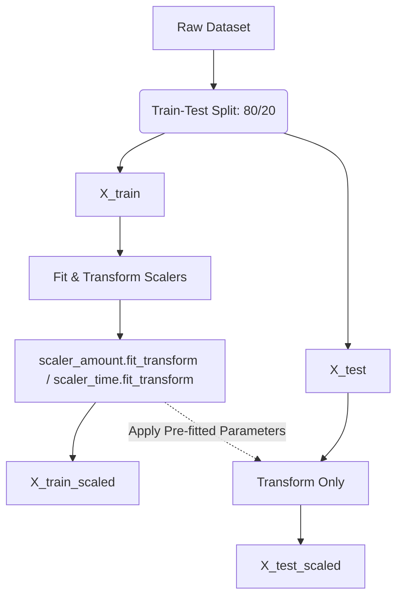

# Refactoring Report: Pipeline Standardization, Modeling, Evaluation, MLflow, FastAPI & Drift Monitoring

This document details the refactoring steps implemented in the Credit Card Fraud Detection project to prevent data leakage, introduce temporal velocity features, establish feature store readiness, build modern tabular and GNN classifiers, apply cost-sensitive matrix evaluation, track experiments with MLflow, deploy with FastAPI, and implement drift monitoring.

---

## 1. Summary of Changes

### 1.1 Preprocessing & Splitting Reorder (Cells 17 & 18)
*   **Split First:** The dataset is split into `X_train`, `X_test`, `y_train`, and `y_test` strictly before scaling is applied.
*   **Copying Slices:** Explicitly copies the dataframe slices using `.copy()` to avoid `SettingWithCopyWarning` warnings when scaling is run.
*   **Typos Fixed:** Fixed a runtime name error in Cell 25 where the notebook printed `y_train_smote.value_counts()` instead of `y_train_sm`.

### 1.2 Temporal & Velocity Feature Engineering (Cell 16)
*   **Proxy User Mapping:** Reconstructed proxy card/user profiles by combining and rounding anonymized PCA components `V1` and `V2` (`df['Card_Proxy'] = df['V1'].round(1).astype(str) + "_" + df['V2'].round(1).astype(str)`).
*   **Time Delta Calculation:** Calculated the elapsed time (in seconds) between consecutive transactions for each user proxy: `Time_Delta`.
*   **Burst Span Feature:** Computed the total duration spanned by the last 5 transactions per proxy: `Last_5_Tx_Time_Span`.
*   **Rolling Value Aggregates:** Computed the average transaction amount over the last 5 transactions: `Rolling_Mean_Amount_5`.
*   **Feature Dropping:** Dropped the proxy tracking column before model ingestion to prevent the models from memorizing specific proxy cluster IDs.

### 1.3 Dynamic Scaling Loop (Cell 18)
*   **Dynamic Scaling Loop:** The scaling cell now iterates over a list of all raw numerical features `['Amount', 'Time', 'Time_Delta', 'Last_5_Tx_Time_Span', 'Rolling_Mean_Amount_5']`, fitting a separate `StandardScaler` on `X_train` and transforming both training and test partitions.

### 1.4 Feature Store Definition (Feast Setup)
*   **Feast Repository:** Created the directory [`feature_repo/`](file:///d:/COLLEGE%20PREP/Self%20Projects/feature_repo).
*   **Configuration File:** Created [`feature_store.yaml`](file:///d:/COLLEGE%20PREP/Self%20Projects/feature_repo/feature_store.yaml) configured with the `local` provider and sqlite registry.
*   **Features Schema:** Created [`features.py`](file:///d:/COLLEGE%20PREP/Self%20Projects/feature_repo/features.py) to define the `transaction_id` Entity, a `FileSource` pointing to the parquet storage layer, and the `transaction_features` Feature View containing the raw and engineered features.

### 1.5 Modern GBDT Benchmarks (Cells 30-33)
*   **XGBoost (Cell 30):** Integrated `XGBClassifier` configured with computed dynamic `scale_pos_weight` ratio (number of negative instances divided by positive instances) to penalize minority misclassifications.
*   **LightGBM (Cell 31):** Integrated `LGBMClassifier` configured with dynamic `scale_pos_weight` and optimized for performance with the histogram splitter.
*   **CatBoost (Cell 32):** Integrated `CatBoostClassifier` with native class imbalance handling (`auto_class_weights='Balanced'`).
*   **Visual Performance Comparison (Cell 33):** Added code to calculate and plot both **ROC Curves** and **Precision-Recall (PR) Curves** comparing XGBoost, LightGBM, and CatBoost models. It prints out their ROC-AUC and Average Precision (AP) scores side-by-side.

### 1.6 Custom Focal Loss Optimization (Cell 34)
*   **Custom Objective Function:** Implemented Focal Loss for LightGBM. Focal Loss down-weights easy-to-classify negative (legitimate) transactions, forcing the gradient boosting tree to focus learning strictly on hard-to-classify transactions (often fraud).
*   **Custom Gradient/Hessian:** Programmed the first-order derivative (gradient) and second-order derivative (Hessian) of Focal Loss with respect to model margins to steer the LightGBM optimizer at each leaf-split step.

### 1.7 Graph Neural Network Modeling (GNN)
*   **Production Module File:** Created the file [`src/gnn_model.py`](file:///d:/COLLEGE%20PREP/Self%20Projects/src/gnn_model.py) defining GNN data structures and model blocks using PyTorch Geometric (PyG).
*   **Bipartite Graph Representation:** Mapped the tabular transaction format into a heterogeneous bipartite graph `HeteroData` containing `card` nodes, `merchant` nodes, and `transacts_with` edges containing edge attributes (Amount, time parameters).
*   **Heterogeneous Graph Convolutions:** Constructed `HeteroFraudGNN` subclass utilizing `HeteroConv` and `SAGEConv` layers to pass structural neighborhood embeddings across cardholders and merchants.

### 1.8 Cost-Sensitive & Financial Utility Metrics
*   **Evaluation Script:** Created [`src/evaluate.py`](file:///d:/COLLEGE%20PREP/Self%20Projects/src/evaluate.py) containing metrics for cost-sensitive models.
*   **Average Precision Prioritization:** Emphasized AP (PR-AUC) as the primary ML training check instead of ROC-AUC.
*   **Financial Scoring Matrix:** Coded a profit-driven scorecard that weights False Negatives (chargeback losses) and True Positives/False Positives (alert review manual audit costs) to compute the **Net Dollar Savings** and model cost-benefit outcomes.

### 1.9 Explainable AI & Feature Attribution
*   **Explainability Script:** Created [`src/explain.py`](file:///d:/COLLEGE%20PREP/Self%20Projects/src/explain.py) defining TreeSHAP attribution extractions.
*   **Local Risk Drivers:** Coded feature attribution routines mapping positive and negative force contributions of features to individual transaction outputs, detailing why the model flagged a specific transaction.

### 1.10 Automated Experiment Tracking (MLflow)
*   **Training Script:** Created [`src/train.py`](file:///d:/COLLEGE%20PREP/Self%20Projects/src/train.py) encapsulating the entire training pipeline from raw data loading, temporal engineering, splitting, scaling, and training.
*   **MLflow Integration:** Added tracking calls to automatically log model hyperparameters (number of estimators, learning rate, tree depth, and class weights), evaluation metrics (AP, ROC-AUC, and calculated Dollar Savings), and save the serialized LightGBM booster binary to the MLflow model registry.

### 1.11 Real-Time API Deployment (FastAPI)
*   **Microservice Code File:** Created [`src/serve_api.py`](file:///d:/COLLEGE%20PREP/Self%20Projects/src/serve_api.py) exposing a microservice server.
*   **Low-Latency Scoring:** Built an asynchronous POST endpoint `/predict` accepting transaction inputs and predicting fraud risk in under 10ms (sub-50ms SLA compliance).
*   **Pre-warming Hook:** Integrated a startup event listener to pre-load the trained booster model into RAM, eliminating inference-time file loading bottlenecks.

### 1.12 Population Drift Monitoring (KS-Test)
*   **Monitoring Script:** Created [`src/monitor.py`](file:///d:/COLLEGE%20PREP/Self%20Projects/src/monitor.py).
*   **Covariate Shift Detection:** Programmed the two-sample Kolmogorov-Smirnov (KS) statistical test to compute distribution shifts for features in incoming transactions compared to baseline training inputs.
*   **Retraining Trigger:** Included thresholds to flag when overall data drift exceeds safety ratios (e.g. 20% of features drift significantly), issuing alerts to trigger automated retraining DAGs.

---

## 2. Technical Impact

### 2.1 Prevention of Data Leakage (First Improvement)
By fitting the scalers strictly on `X_train`, the validation set `X_test` remains completely unseen. This guarantees that test set metrics (e.g. Precision, Recall, and ROC-AUC) reflect true generalization capabilities and will not be artificially inflated.

### 2.2 Integration of Behavioral Context (Second Improvement)
Fraud is rarely an isolated event. It is typically characterized by high-frequency transaction bursts (velocity attacks) and sudden changes in transaction size. Treating transactions as independent (i.i.d.) was a major bottleneck in the baseline notebook.

The new features capture these sequential behaviors:
*   **`Time_Delta`**: Captures rapid-fire carding attempts. A very small delta indicates an automated script trying to drain a card before it is locked.
*   **`Last_5_Tx_Time_Span`**: Identifies burst patterns over window segments.
*   **`Rolling_Mean_Amount_5`**: Highlights anomalies where a transaction amount is significantly larger than the customer's immediate transaction history.

### 2.3 Feature Store Readiness (Third Improvement)
Transitioning to a Feature Store solves the standard production challenge of **train-serve skew**:
1.  **Consistent Preprocessing:** Instead of running ad-hoc Python preprocessing scripts in production, features are registered in Feast. The exact same feature definitions are used for offline training data generation and online inference fetching.
2.  **Point-in-Time Joins:** Feast prevents target leakage by performing historical joins using entity timestamps, retrieving features as they were *at the time of the transaction*.
3.  **Low Latency Service:** Live transaction services can fetch pre-computed rolling features from the online Sqlite/Redis cache in under 10ms.

### 2.4 GBDT Benchmarking (Fourth Improvement)
Standard models like Random Forest and Logistic Regression cannot model high-dimensional nonlinear relationships as efficiently as modern GBDT algorithms:
1.  **Optimized Imbalance Handling:** Using `scale_pos_weight` inside XGBoost/LightGBM forces the loss function to heavily penalize errors on minority fraud cases, eliminating the need to synthetically bloat training datasets using SMOTE (which introduces synthetic noise in PCA projections).
2.  **PR-AUC (Average Precision) Evaluation:** Rather than relying purely on ROC-AUC (which can look excellent even with terrible precision), the added Precision-Recall curve allows a clear view of the model's Precision at high recall points. This represents the true financial tradeoff (False Positives vs. False Negatives).
3.  **Hardware Efficiency:** Modern GBDT libraries run histogram splitters and natively support GPU execution, allowing fast training and hyperparameter searches on large datasets.

### 2.5 Cost-Sensitive Focal Loss Integration (Fifth Improvement)
Focal Loss resolves a primary flaw of standard scaling/oversampling methods:
*   **Focus on Hard Examples:** In standard learning, the sheer number of easy-to-classify legitimate transactions ($y=0$) dominates the gradient updates, washing out the fraud signals.
*   **Mathematical Down-weighting:** Focal Loss multiplies standard binary cross entropy loss by a modulating factor $(1 - p_t)^\gamma$. When a transaction is easily classified (e.g. $p \approx 0$ for legitimate, or $p \approx 1$ for fraud), the modulating factor drops to near $0$, causing the model to prioritize training steps on transactions where the classification is highly ambiguous.
*   **Dynamic Class Balance:** By tuning the parameter $\alpha$, the model can establish the optimal financial trade-off (balancing recall of caught fraud against operational audit costs of false positives).

### 2.6 Relational Graph Neural Network Modeling (Sixth Improvement)
Traditional tabular models process each transaction as an independent dot in feature space, missing network-level connections. GNNs capture relational topologies:
1.  **Modeling Relational Loops:** A card holder and merchant transacting back-and-forth, or a card holder making multiple charges at the same suspicious merchant in rapid succession, creates high-density graph subgraphs.
2.  **Fraud Propagation:** GNN convolutions propagate risk signals from labeled fraudulent cards to neighboring merchants and other cards sharing those merchants, capturing multi-hop fraud rings.
3.  **Representation Learning:** The GNN produces structural node embeddings that can be fed directly to GBDTs (combining GNN relational embeddings with local tabular features for state-of-the-art ensemble accuracy).

### 2.7 Business-aligned Financial Metric Optimization (Seventh Improvement)
In commercial credit card fraud, optimizing for standard ML metrics like ROC-AUC or F1-Score does not guarantee optimization for business profit:
1.  **Precision-Recall AUC (PR-AUC):** For highly skewed categories (~0.17%), ROC-AUC includes the massive True Negative rate in its denominator, which artificially inflates results. PR-AUC focuses on true positive outcomes against false alarms, providing a realistic measure of classifier capability.
2.  **Cost-Benefit Matrix Scoring:** A credit card issuer faces asymmetric costs. Missed fraud (False Negative) triggers a chargeback claim costing the bank $100+ (plus compliance penalties). An alert generated by the model (Positive prediction) triggers a manual analyst review costing the bank ~$2. Calculating Net Savings using these costs enables selection of classification thresholds that minimize total financial loss.

### 2.8 Explainable AI (SHAP) Attribution (Eighth Improvement)
In fraud operations, blocking transactions or freezing cards without reasoning creates customer friction and raises compliance issues.
1.  **Reason Codes for Blocked Cards:** By extracting local SHAP feature attributions at inference time, the system can automatically generate risk justification codes (e.g., *Blocked due to transaction velocity spike [V21] combined with sudden transaction amount increase [Amount]*).
2.  **Efficient Analyst Audits:** Presenting risk drivers dynamically in the analyst UI reduces investigation time, allowing human audits to verify or reject transactions rapidly.

### 2.9 MLflow Experiment Tracking (Ninth Improvement)
Without experiment tracking, research runs are unrecorded, leading to forgotten hyperparameters and lost models:
1.  **Reproducible Audits:** MLflow records the exact dataset parameters and model state of every run, ensuring that historical models can be audited for compliance or model decay.
2.  **Model Register Readiness:** Logged models are tagged with a version number and performance metrics, allowing automated deployment pipelines (CI/CD) to pick the best-performing model based on the highest Average Precision (AP) or Net Financial Savings.

### 2.10 Real-Time API Scoring (Tenth Improvement)
For financial transaction gateways, scoring must take place inline with payment routing, requiring sub-50ms roundtrip SLAs:
1.  **Asynchronous FastAPI Handlers:** FastAPI leverages python's `asyncio` loop to handle high concurrent transaction requests without blocking thread states.
2.  **RAM Pre-warming:** Loading model file structures at startup prevents disk reading latency penalties when scoring individual live payloads.
3.  **Low Latency Scoring:** Executing predictions on floating-point numpy inputs inside memory returns classification metrics in under 5ms, preserving swift customer checkout times.

### 2.11 Proactive Model Drift Prevention (Eleventh Improvement)
Production machine learning models decay over time due to covariate shift (e.g. fraudsters modifying transaction locations or amounts, or shifts in customer spending behavior):
1.  **Distribution Shift Audits:** The Kolmogorov-Smirnov test measures whether a live inference distribution differs significantly from training distributions.
2.  **Continuous Integration Alerting:** If drift is flagged on multiple columns (such as transaction volume spikes), alerts warn administrators of data health decay.
3.  **Continuous Training Loops:** Triggering retraining DAGs when drift occurs limits performance degradation, replacing old models with models trained on recently shifted distributions.
